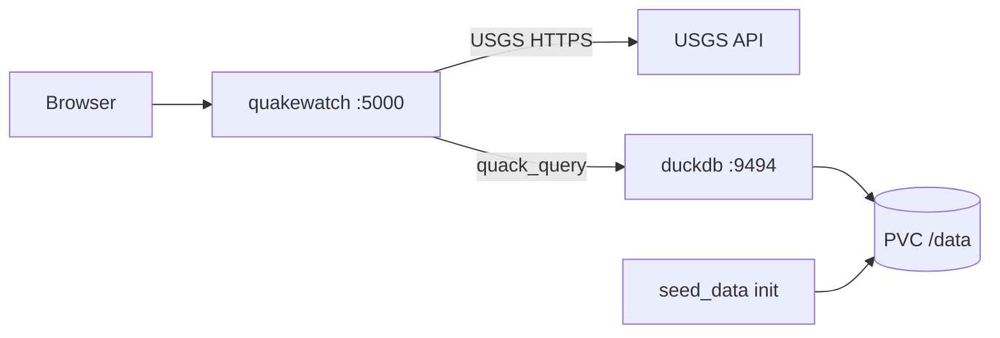

# Final project — QuakeWatch

Docker image and Kubernetes manifests for a customized [QuakeWatch](https://github.com/EduardUsatchev/QuakeWatch) Flask app (namespace `final-project`).

The upstream project queries live earthquake data from the USGS API. This fork extends it with a **DuckDB + Quack** backend: historical earthquake statistics are served from a local database while the web UI still uses USGS for graphs and recent events.

## Architecture



| Service | Role |
| ------- | ---- |
| **quakewatch** | Flask web app (`app.py`) — dashboards, USGS graphs, health routes |
| **duckdb** | DuckDB Quack server (`duckdb-quack-service.py`) — read-only `earthquakes` table over the Quack protocol |

Docker Compose runs both services locally. Kubernetes deploys them as separate Deployments with a shared ConfigMap, Secret, and PersistentVolume for the database file.

## Customizations from upstream QuakeWatch

Application source lives in **`Quakewatch/`** (fork of [EduardUsatchev/QuakeWatch](https://github.com/EduardUsatchev/QuakeWatch)).

| Change | Details |
| ------ | ------- |
| **Remote DuckDB stats** | New `quakestats.py` — `QuakeStats` queries the remote DB via `quack_query()` using `QUACK__HOST`, `QUACK__PORT`, and `QUACK__TOKEN` |
| **Quack server** | New `duckdb-quack-service.py` — serves `earthquakes.duckdb` with `quack_serve()` on port 9494 |
| **Seed data** | New `seed_data.py` — downloads `Earthquakes-1990-2023.parquet` and creates the `earthquakes` table if missing |
| **Dashboard** | `dashboard.py` — `/graph-earthquakes` uses `QuakeStats` for median magnitude, time-between-quakes, and max event in the selected area |
| **Templates** | `graph_dashboard.html` — statistics cards for the selected region |
| **Dependencies** | `requirements.txt` — added `duckdb`, `pandas` |
| **Image build** | `Dockerfile` — pre-installs DuckDB `spatial` extension |
| **Compose** | `docker-compose.yml` — two services (`quakewatch` + `duckdb`), shared Quack token, bind-mounted `seed-data` volume |
| **Seed dataset** | `seed-data/Earthquakes-1990-2023.parquet` — historical earthquake records |

Environment variables (double underscore convention):

| Variable | Used by | Purpose |
| -------- | ------- | ------- |
| `QUAKEWATCH__LOG_PATH` | `app.py` | Rotating log directory |
| `MPLCONFIGDIR` | `app.py` (matplotlib) | Writable matplotlib cache path |
| `QUACK__HOST` | `quakestats.py` | DuckDB service hostname (`duckdb` in K8s) |
| `QUACK__PORT` | `quakestats.py`, `duckdb-quack-service.py` | Quack protocol port (`9494`) |
| `QUACK__TOKEN` | `quakestats.py`, `duckdb-quack-service.py` | Shared auth token (Secret in K8s) |
| `DUCKDB__PATH` | `seed_data.py`, `duckdb-quack-service.py` | Path to DuckDB file on disk |

## Files and folders

### Root — Docker

| File | Purpose |
| ---- | ------- |
| [Dockerfile](Dockerfile) | Builds `mlsokolova/quakewatch` from `python:3.11-slim` and `Quakewatch/` |
| [docker-compose.yml](docker-compose.yml) | Runs `quakewatch` (port 5000) and `duckdb` (ports 5001, 9494) with shared seed volume |

### Root — Kubernetes

| File | Purpose |
| ---- | ------- |
| [quakewatch.yaml](quakewatch.yaml) | `Deployment` + `NodePort` `Service` for the web app; init container waits for DuckDB Quack |
| [duckdb.yaml](duckdb.yaml) | `Deployment` + `ClusterIP` `Service` for DuckDB Quack; init container runs `seed_data.py` |
| [configmap-quakewatch.yaml](configmap-quakewatch.yaml) | Non-sensitive config (`QUAKEWATCH__LOG_PATH`, `MPLCONFIGDIR`, `QUACK__HOST`, `QUACK__PORT`, `DUCKDB__PATH`) |
| [secret-quakewatch.yaml](secret-quakewatch.yaml) | `QUACK__TOKEN` |
| [pv-duckdb.yaml](pv-duckdb.yaml) | `PersistentVolume` + `PersistentVolumeClaim` for `/data` (DuckDB file) |
| [cronjob-quakewath-check.yaml](cronjob-quakewath-check.yaml) | `CronJob` health check via `curl` to `/graph-earthquakes` |
| [hpa-quakewatch.yaml](hpa-quakewatch.yaml) | Horizontal Pod Autoscaler for `quakewatch` |
| [components.yaml](components.yaml) | [metrics-server](https://github.com/kubernetes-sigs/metrics-server) v0.8.1 with `--kubelet-insecure-tls` (local clusters) |

### `Quakewatch/`

| File | Purpose |
| ---- | ------- |
| `app.py` | Flask app factory, logging setup |
| `dashboard.py` | HTTP routes (`/health`, `/ping`, earthquake pages, USGS APIs, `QuakeStats` integration) |
| `quakestats.py` | Remote DuckDB queries via Quack |
| `duckdb-quack-service.py` | DuckDB Quack server entrypoint |
| `seed_data.py` | Parquet download and table bootstrap |
| `utils.py` | Country/region settings, matplotlib graphs, USGS helpers |
| `requirements.txt` | Python dependencies |
| `templates/` | Jinja2 HTML (`base.html`, main and graph dashboards) |
| `static/` | Static assets (logo) |

### `seed-data/`

| File | Purpose |
| ---- | ------- |
| `Earthquakes-1990-2023.parquet` | Source dataset; loaded into DuckDB by `seed_data.py` |

### `docs/`

| File | Purpose |
| ---- | ------- |
| [1-Docker.md](docs/1-Docker.md) | Phase 1: build, run, compose, push image tag `3.0.0` |
| [2-Kubernetes.md](docs/2-Kubernetes.md) | Phase 2: namespace, ConfigMap, Secret, PV, DuckDB + QuakeWatch deploy, CronJob, HPA |
| [install-kubernetes-cluster.pdf](docs/install-kubernetes-cluster.pdf) | Docker Desktop Kubernetes on Windows 11 |

## Quick start — Kubernetes

```bash
kubectl create ns final-project
kubectl config set-context --current --namespace=final-project

kubectl apply -f configmap-quakewatch.yaml
kubectl apply -f secret-quakewatch.yaml
kubectl apply -f pv-duckdb.yaml
kubectl apply -f duckdb.yaml
kubectl apply -f quakewatch.yaml
```

Image tag: `mlsokolova/quakewatch:3.0.0`
